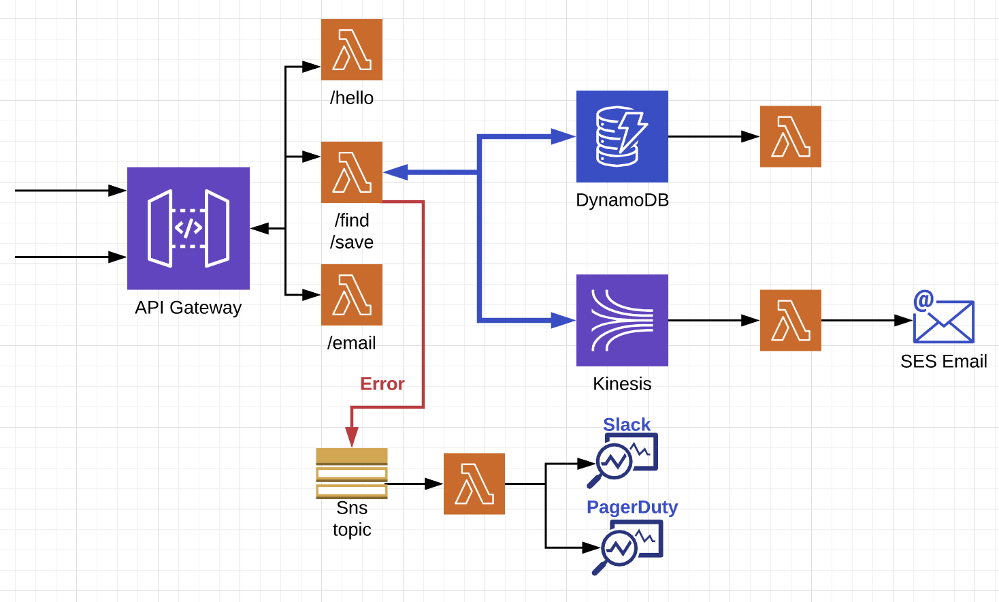

# Serverless Demo
A quick few samples to demonstrate the ease of deploying serverless functions.
Using the [Serverless Framework](https://serverless.com/)
 

  

  

## Install
- Ensure you have [AWS credentials](https://docs.aws.amazon.com/cli/latest/userguide/cli-chap-getting-started.html) 
for the account you are trying to deploy to pre-set in your environment
- Make sure your user has IAM permissions for **dynamo, apigateway, lambda, kinesis**
- `brew install npm`
- [Install docker ](https://docs.docker.com/install/)
- `npm install serverless -g`
- `npm install --save serverless-python-requirements`
- `npm install serverless-domain-manager --save-dev`
- `pip3 install -r requirements.txt`

## Commands
- `sls` is the same as `serverless`
- DEPLOY SINGLE FUNCTION ONLY: `sls deploy --region us-east-1 -f sendEmail --verbose --env <environment>`
- LOGS: `serverless logs -f sendEmail -t --env <environment>`
- LOCAL INVOKE: `sls invoke -f sendEmail -l`
- INFO: `sls info --env <environment>`

## Deploy
- `sls create_domain --env <environment> --region <regionName>` [**Note : You only need to do this once.** 
This could take ~40 mins to propagate across the DNS hierarchy]
- `sls deploy --env <environment> --region <regionName> --verbose`

## Remove
- `sls delete_domain --env <environment> --region <regionName>`
- `sls remove --env <environment> --region <regionName>`

## Command line options
- `env` to deploy lambda functions (and api gateway endpoints) differentiated by the env value 
- `account` to deploy the stack to a specific aws account
- `region` to deploy the stack to a specific aws region (default = `us-west-2`)
- `domain` which domain to use for the deployment

## Testing
- `python3 -m unittest -h` (see help)
- `python3 -m unittest -v` (run all tests)
- `python3 -m unittest test/test_dynamo.py` (to test a specific file/module/test)

## Considerations
- AWS `Concurrent Requests` limit (the total number of concurrent lambdas executing at the same time)
    - `Concurrent Requests (Expected Duration * Expected Requests per Second)`
- DynamoDB provisioned throughput: can be manually set to autoscale (or use a plugin), but unsure as to how long the increased scale takes to come into effect
- If you notice a spike in latency due to [cold start times](https://hackernoon.com/cold-starts-in-aws-lambda-f9e3432adbf0), you might consider keeping some/all functions warm. Check this [`README`](src/README.md) 

## Error Handling
All errors will be printed to the logs/console and the corresponding event will be sent to an SNS topic, requiring explicit handling.

## API Documentation
#### V1 `/api/v1`
| resource                                     |  type  |   description              |
|:--------------                               |:-------|----------------------------|
| [/hello](#hello)                             | GET    |   simple hello world api gateway endpoint backed by a Lambda
| [/test](#test)                               | GET    |   simple function that force drops the message to an error SNS topic
| [/email/send](#email)                        | POST   |   api gateway endpoint backed by a Lambda, which uses ses to send an email
| [/find/{key}](#find)            | GET    |   api gateway endpoint backed by a Lambda which looks in dynamo for item identified by {key}
| [/save/{key}/{data}](#save)     | POST   |   api gateway endpoint backed by a Lambda which saves into dynamo an item `{key=value}`. If the key or value contain the word `email`, an email will also be sent

___

### Hello world
- **REQUEST**: `curl https://example.com/api/v1/hello`
- **RESPONSE**: 
    - _SUCCESS_: `Hello World`, Status code: `200`
    - _FAILURE_: `<Error Message>`, Status code: `400`

___

### Test SNS
- **REQUEST**: `curl https://example.com/api/v1/test`
- **RESPONSE**: 
    - _FAILURE_: `<Error Message>`, Status code: `500`

___

### Send email
- **REQUEST**: `curl -XPOST https://example.com/api/v1/email/send -d '{"name":"name", "email":"arjun@example.com", "content":"hello"}'`
- **RESPONSE**: 
    - _SUCCESS_: `Successfully sent email`, Status code: `200`
    - _FAILURE_: `<Error Message>`, Status code: `400`

___

### Lookup item
- **REQUEST**: `curl https://example.com/api/v1/find/keyword`
- **RESPONSE**: 
    - _SUCCESS_: `<{found item}>`, Status code: `200`
    - _SUCCESS_: `No items found for keyword keyword in dynamo`, Status code: `200`
    - _FAILURE_: `ERROR: Could not execute find!`, Status code: `500`

___

### Save item
- **REQUEST**: `curl https://example.com/api/v1/save/keyword/value`
- **RESPONSE**: 
    - _SUCCESS_: `keyword persisted in dynamo`, Status code: `200`
    - _FAILURE_: `ERROR: Could not execute save!`, Status code: `500`
